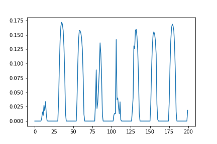
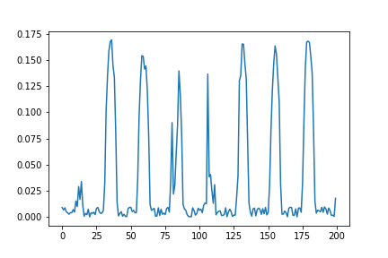

# MPPT-using-AI-Techniques

A academic research project under Dr. Hari Om Bansal, Associate Professor, BITS Pilani. This project proposes a novel sets of inputs to Deep Neural Networks, that comprehensively describe the ambient conditons of a location, and ways to handle and train on such inputs.
It is submitted to "“Intelligent Renewable Energy Systems: Integrating AI Techniques and Optimization Algorithms”, as a book chapter, in Wiley, Scrivener Publishing, Scopus indexing, and is currently under review.

Dataset:
Collected through the Photovoltaic simulation dataset from System Advisor Model (SAM), an application developed by National Renewable Energy Laboratory, USA  
(https://sam.nrel.gov/)

This dataset consists of half-hourly weather files for 49 different cities in USA. 

Results:

Actual optimized power produced by a 2mx2m generic PV cell:

Results from the model:

Power prediction error: 0.47%
